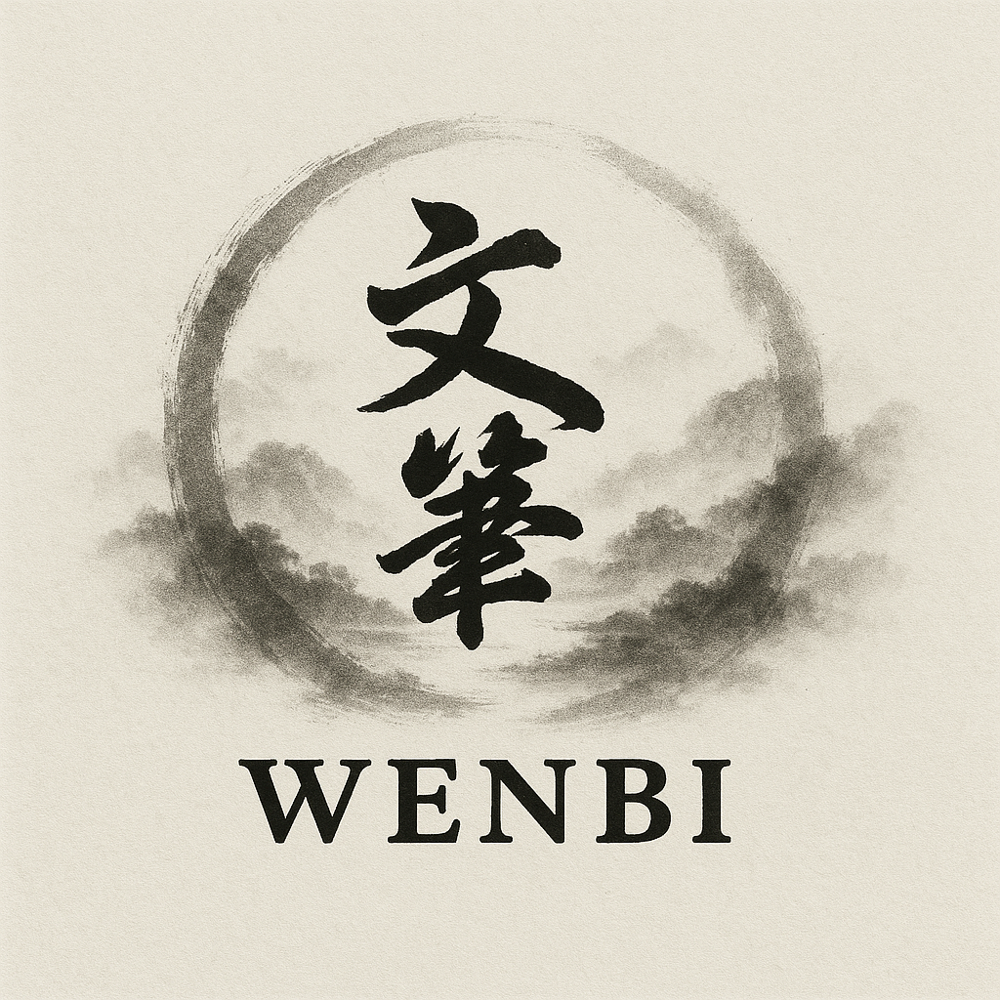

<p align="center">
  
</p>

# 🎬 Wenbi: Intelligent Media-to-Text and Text-to-Text Processing

**Transform your audio and video content into polished, academic-quality written documents with AI precision!**

[](https://python.org)
[](LICENSE)
[](pyproject.toml)

Wenbi is a revolutionary CLI tool and web application that **focuses on media-to-text and text-to-text processing**. Whether you're a researcher, student, content creator, or professional, Wenbi transforms your raw audio/video content and existing text documents into beautifully formatted, academically rigorous documents.

## ✨ Why Wenbi?

**🎯 From Speech to Scholarship**: Convert lectures, interviews, podcasts, and presentations into publication-ready academic texts

**🌍 Universal Language Bridge**: Seamlessly translate and adapt content across languages while maintaining academic integrity

**📝 Intelligent Rewriting**: Transform casual speech patterns into formal, written expression with perfect grammar and flow

**⏱️ Time-Stamped Precision**: Maintain full traceability with timestamp citations linking back to original audio/video sources

**🧠 LLM-Powered Excellence**: Harness the power of multiple AI models (OpenAI GPT, Google Gemini, Ollama) for superior results

## 🚀 Core Features

### 📹 **Multimedia Processing Powerhouse**
- **Universal Input Support**: Seamlessly handle videos (MP4, AVI, MOV, MKV), audio files (MP3, FLAC, AAC), YouTube URLs, and subtitle files (VTT, SRT, ASS)
- **Advanced Transcription**: Powered by OpenAI Whisper with configurable model sizes (large-v3-turbo recommended)
- **Time-Stamped Output**: NEW! `--cite-timestamps` feature maintains precise traceability with markdown headers showing exact time ranges

### 🧠 **AI-Powered Text Transformation**
- **Intelligent Rewriting**: Transform casual spoken language into polished written prose
- **Academic Excellence**: Elevate content to publication-quality academic standards with proper citations and formal structure
- **Smart Translation**: Contextually accurate translations that preserve meaning and academic integrity
- **Multi-LLM Support**: Choose from OpenAI GPT-4, Google Gemini, or local Ollama models

### 🔧 **Professional Workflow Tools**
- **Batch Processing**: Process entire directories of media files with `wenbi-batch`
- **Flexible Configuration**: YAML-based configurations for complex, repeatable workflows
- **Document Processing**: Handle DOCX documents and various text formats
- **Web Interface**: Beautiful Gradio GUI for non-technical users
- **Multi-language Intelligence**: Automatic language detection and cross-lingual processing

## 💼 Real-World Use Cases

### 🎓 **Academic Research**
```bash
# Transform lecture recordings into formatted academic notes with timestamps
wenbi lecture_recording.mp4 --llm gemini/gemini-2.0-flash --cite-timestamps --output-dir ./course_notes

# Convert research interview to academic paper format
wenbi interview.mp3 rewrite --style academic --llm openai/gpt-4o --lang English
```

### 📚 **Content Creation**
```bash
# Turn podcast episodes into blog posts
wenbi rewrite podcast_episode.mp3 --llm ollama/qwen3 --lang English --chunk-length 6

# Process YouTube educational content for documentation
wenbi "https://youtube.com/watch?v=example" --llm gemini/gemini-1.5-flash --cite-timestamps
```

### 🌐 **International Collaboration**
```bash
# Translate conference presentations with academic precision
wenbi conference_talk.mp4 translate --llm gemini/gemini-2.0-flash --lang French --cite-timestamps

# Process multilingual research materials
wenbi research_video.mp4 --multi-language --translate-lang English --rewrite-lang Chinese
```

## ⚡ Quick Start

### Prerequisites
- Python 3.10+ 
- For commercial LLMs: API keys (`OPENAI_API_KEY`, `GOOGLE_API_KEY`)
- For local LLMs: [Ollama](https://ollama.ai/) installation

### Installation

Wenbi can be installed using multiple package managers:

#### **📦 Install with pip (recommended)**
```bash
# Install from PyPI
pip install wenbi

# Quick test - process a subtitle file with timestamps
wenbi your_subtitle.vtt --cite-timestamps --llm gemini/gemini-1.5-flash
```

#### **⚡ Install with uv (fastest)**
```bash
# Install with uv for fastest installation
uv pip install wenbi

# Quick test
wenbi your_content.mp4 --cite-timestamps --llm gemini/gemini-1.5-flash
```

#### **🔧 Development installation with Rye**
```bash
# Clone the repository for development
git clone https://github.com/areopagusworkshop/wenbi.git
cd wenbi

# Install dependencies with Rye
rye sync

# Activate the virtual environment
rye shell

# Quick test - process a subtitle file with timestamps
wenbi your_subtitle.vtt --cite-timestamps --llm gemini/gemini-1.5-flash
```

### 🎯 **NEW: Timestamp Citation Feature**

The `--cite-timestamps` option transforms your output with precise time-stamped sections:

**Input**: Regular VTT/SRT subtitle file  
**Output**: Markdown with timestamp headers

```markdown
### **00:00:00 - 00:00:23**

This introductory section discusses the fundamental concepts of the topic, establishing the theoretical framework that will guide our understanding throughout the presentation.

### **00:00:23 - 00:00:45**

The speaker then transitions to examining the practical applications, demonstrating how these theoretical principles manifest in real-world scenarios.
```

**Perfect for**: Academic note-taking, research documentation, content verification, and creating citeable references to audio/video sources!

## Usage

### CLI (Command Line Interface)

Wenbi provides a powerful CLI for various tasks. The main entry point is `wenbi`.

#### Main Command

Process a single input file (video, audio, URL, or text file) to generate Markdown and CSV outputs.

```bash
wenbi <input_file_or_url> [options]

# Example: Process a video file
wenbi my_video.mp4 --output-dir ./output --lang English

# Example: Process a YouTube URL
wenbi https://www.youtube.com/watch?v=dQw4w9WgXcQ --llm gemini/gemini-1.5-flash --lang Chinese

# Example: Process a VTT subtitle file
wenbi subtitles.vtt --output-dir ./output --lang English

# Example: Process a DOCX file for academic rewriting (requires --llm)
wenbi rewrite document.docx --style academic --llm ollama/qwen3 --lang English
```

**Common Options:**

*   `-c, --config <path>`: Path to a YAML configuration file.
*   `-o, --output-dir <path>`: Directory to save output files.
*   `--llm <model_identifier>`: Specify the LLM model to use (e.g., `ollama/qwen3`, `gemini/gemini-1.5-flash`, `openai/gpt-4o`).
*   `--cite-timestamps`: **NEW!** Include precise timestamp headers in output markdown (format: `### **HH:MM:SS - HH:MM:SS**`)
*   `-s, --transcribe-lang <language>`: Language for transcription (e.g., `Chinese`, `English`).
*   `-l, --lang <language>`: Target language for translation/rewriting (default: `Chinese`).
*   `-m, --multi-language`: Enable multi-language processing.
*   `-cl, --chunk-length <int>`: Number of sentences per paragraph (default: 20).
*   `-mt, --max-tokens <int>`: Maximum tokens for LLM output (default: 130000).
*   `-to, --timeout <int>`: LLM request timeout in seconds (default: 3600).
*   `-tm, --temperature <float>`: LLM temperature parameter (default: 0.1).
*   `-tsm, --transcribe-model <model_size>`: Whisper model size for transcription (e.g., `large-v3`).
*   `-ow, --output_wav <filename>`: Filename for saving the segmented WAV (optional).
*   `-st, --start_time <HH:MM:SS>`: Start time for extraction from media.
*   `-et, --end_time <HH:MM:SS>`: End time for extraction from media.

#### Subcommands

Wenbi provides specific subcommands for different processing tasks:

```bash
# Rewrite text (oral → written)
wenbi rewrite <input_file> --llm ollama/qwen3 --lang Chinese

# Academic rewriting for scholarly style
wenbi rewrite <input_file> --style academic --llm openai/gpt-4o --lang English

# Translate text to target language
wenbi translate <input_file> --llm gemini/gemini-1.5-flash --lang French

# Combine speech with presentation slides (video-based)
wenbi ppt <video_or_audio_or_url> --llm ollama/qwen3 --lang English
# (abbreviated: wenbi p <video_or_audio_or_url>)
```

**PPT Subcommand**: The `ppt` subcommand combines speech with slides from video:
- Accepts **video/audio/URL** input
- Supports **3 slide extraction modes**:
  - default frame method
  - `--cropped-slide` for RTDETR ROI extraction
  - `--ppt` for PDF/PPT/PPTX/image matching
- Transcribes and rewrites speech using the rewrite pipeline
- Always includes timestamp headers in speech output (needed for alignment)
- Inserts slides before matching speech sections by **timestamp alignment**
- Outputs combined markdown and a cleaned version unless `--no-clean`

Examples:
```bash
# Merge lecture recording with presentation slides
wenbi ppt lecture.mp4 --ppt presentation.pdf \
  --llm gemini/gemini-1.5-flash \
  --lang English \
  --output-dir ./lecture_notes

# Auto slide extraction from video frames
wenbi ppt lecture.mp4 \
  --lang English \
  --output-dir ./notes
```

Subcommands share common options with the main command.

**Note:** `wenbi rewrite --style academic` writes `{basename}_academic.md`.

#### **🎥 Advanced Video Slides Extraction**

The PPT subcommand extracts slides directly from video presentations with a multi-phase workflow:

**Workflow Phases:**
1. **Frame Extraction**: Extracts frames at regular intervals (default: every 60 seconds)
2. **ROI Detection**: Detects slide region using hybrid OpenCV methods
3. **Slide Cropping**: Isolates slide content from background/UI
4. **Deduplication**: Removes duplicate slides using SSIM image comparison (default: 0.98 threshold)
5. **OCR Processing**: Extracts text from unique slides using marker-pdf (unless `--no-ocr`)
6. **Speech Transcription**: Transcribes full video audio
7. **Merge**: Combines slides with speech by timestamp alignment

**Quick Examples:**

```bash
# Automatic slide detection with default settings
wenbi ppt lecture.mp4

# Custom frame extraction interval (every 2 minutes)
wenbi ppt lecture.mp4 --frame-interval 120

# Manual ROI override (skip auto-detection)
wenbi ppt lecture.mp4 --roi "100,50,1660,850"

# Per-frame ROI detection (each frame gets own detection)
wenbi ppt lecture.mp4 --each-roi

# Process only first 30 minutes of video for slides
wenbi ppt long_lecture.mp4 --end-time "00:30:00"

# Full example with options
wenbi ppt lecture.mp4 \
  --frame-interval 60 \
  --ssim-threshold 0.95 \
  --llm gemini/gemini-1.5-flash \
  --lang English \
  --output-dir ./lecture_notes
```

**Video Slides Options:**
- `--frame-interval N`: Extract frames every N seconds (default: 60)
- `--end-time HH:MM:SS`: Only extract slides up to this time (default: 01:00:00)
- `--roi "x0,y0,x1,y1"`: Manual slide region override in pixels (skips auto-detection)
- `--each-roi`: Enable per-frame ROI detection instead of single ROI
- `--ssim-threshold F`: SSIM threshold for deduplication (default: 0.98, range: 0.0-1.0)
- `--hist-threshold F`: Histogram correlation threshold (default: 0.15, range: 0.0-1.0)
- `--max-slides N`: Maximum slides to extract (default: 20)
- `--cropped-slide [auto|x0,y0,x1,y1]`: RTDETR-based slide cropping (optional ROI)
- `--ppt <path>`: Use PDF/PPT/PPTX/image matching for slides
- `--no-ocr`: Skip OCR and embed slide images as base64
- `--no-clean`: Keep timestamps and image references in final output

**Detection Algorithm:**
The hybrid detection combines multiple OpenCV techniques for robust slide boundary detection:
- **Canny Edge Detection**: Detects sharp boundaries in the image
- **Morphological Operations**: Cleans edges and connects fragmented regions
- **Color-based Thresholding**: Separates slides from background by color analysis
- **Hough Line Detection**: Finds straight edges as backup method
- **Intelligent Fallback**: Uses center 80% of frame if all methods fail

**Output Structure:**
```
output_dir/
├── _extracted_frames/          # All extracted frames
├── {basename}_slides/          # Cropped slide images (when applicable)
├── {basename}_slides.md        # Extracted slide content with OCR (frame method)
├── {basename}_ppt.md           # Extracted slide content (PPT/PDF matching)
├── {basename}_rewritten.md     # Transcribed & rewritten speech (timestamped)
├── {basename}_combine.md       # Final integrated document
└── {basename}_combine_clean.md # Cleaned output (unless --no-clean)
```

**Use Cases:**
- 📚 Lecture recordings → academic notes with slides
- 🎓 Conference talks → proceedings with presentations
- 📊 Training videos → documentation with slide content
- 🎬 Educational content → structured reference material

For detailed configuration and examples, see [VIDEO_SLIDES_USAGE.md](VIDEO_SLIDES_USAGE.md).

### Batch Processing

Process multiple media files in a directory using `wenbi-batch`.

```bash
wenbi-batch <input_directory> [options]

# Example: Process all media files in 'my_media_folder'
wenbi-batch my_media_folder --output-dir ./batch_output --translate-lang English

# Example: Process with a config file and combine markdown outputs
wenbi-batch my_media_folder -c config/batch-config.yml --md combined_output.md
```

**Batch Options:**

*   `-c, --config <path>`: Path to a YAML configuration file for batch processing.
*   `--output-dir <path>`: Output directory for batch results.
*   `--rewrite-llm <model_id>`: LLM for rewriting.
*   `--translate-llm <model_id>`: LLM for translation.
*   `--transcribe-lang <language>`: Language for transcription.
*   `--translate-lang <language>`: Target language for translation (default: `Chinese`).
*   `--rewrite-lang <language>`: Target language for rewriting (default: `Chinese`).
*   `--multi-language`: Enable multi-language processing.
*   `--chunk-length <int>`: Number of sentences per chunk.
*   `--max-tokens <int>`: Maximum tokens for LLM.
*   `--timeout <int>`: LLM timeout in seconds.
*   `--temperature <float>`: LLM temperature.
*   `--md [path]`: Output combined markdown file. If no path, uses input folder name.

### Configuration Files (YAML)

Wenbi supports YAML configuration files for both single input and batch processing. This allows for more complex and reusable configurations.

**Example `single-input.yaml`:**

```yaml
input: "path/to/your/video.mp4"
output_dir: "./my_output"
llm: "gemini/gemini-1.5-flash"
lang: "English"
chunk_length: 10
```

**Example `multiple-inputs.yaml` (for `wenbi` main command):**

```yaml
inputs:
  - input: "path/to/video1.mp4"
    segments:
      - start_time: "00:00:10"
        end_time: "00:00:30"
        title: "Introduction"
      - start_time: "00:01:00"
        end_time: "00:01:30"
        title: "Key Points"
  - input: "path/to/audio.mp3"
    llm: "ollama/qwen3"
    lang: "Chinese"
```

**Example `batch-folder-config.yml` (for `wenbi-batch`):**

```yaml
output_dir: "./batch_results"
translate_llm: "gemini/gemini-1.5-flash"
translate_lang: "French"
chunk_length: 12
```

### Gradio GUI

Launch the web-based Gradio interface for an interactive experience:

```bash
wenbi --gui
```

### 🐍 Programmatic Usage (Python API)

Wenbi can be used as a Python library for integration into your own applications:

```python
from wenbi.main import process_input
from wenbi.model import rewrite, translate, academic
from wenbi.utils import transcribe, parse_subtitle

# Process a video file with timestamp citations
result = process_input(
    file_path="lecture.mp4",
    llm="gemini/gemini-1.5-flash",
    subcommand="academic",
    lang="English",
    cite_timestamps=True,
    output_dir="./output"
)

# Direct text processing
academic_text = academic(
    "input.vtt",
    output_dir="./output",
    llm="openai/gpt-4o",
    academic_lang="English",
    cite_timestamps=True
)

# Transcribe audio/video to VTT
vtt_file, csv_file = transcribe(
    "audio.mp3",
    language="English",
    output_dir="./output",
    model_size="large-v3-turbo"
)

# Translate existing text
translated = translate(
    "document.txt",
    output_dir="./output",
    translate_language="French",
    llm="gemini/gemini-2.0-flash",
    cite_timestamps=False
)
```

**Key Functions:**
- `process_input()`: Main processing pipeline
- `transcribe()`: Audio/video to text transcription
- `rewrite()`: Oral to written text transformation  
- `translate()`: Language translation
- `academic()`: Academic style transformation
- `parse_subtitle()`: Process existing subtitle files

## Supported Input Types

**Wenbi focuses on media-to-text and text-to-text processing:**

*   **Video:** `.mp4`, `.avi`, `.mov`, `.mkv`, `.flv`, `.wmv`, `.m4v`, `.webm`
*   **Audio:** `.mp3`, `.flac`, `.aac`, `.ogg`, `.m4a`, `.opus`
*   **URLs:** YouTube and other web URLs.
*   **Subtitle Files:** `.vtt`, `.srt`, `.ass`, `.ssa`, `.sub`, `.smi`
*   **Text Files:** `.txt`, `.md`, `.markdown`
*   **Document Files:** `.docx`

## Output

Wenbi generates the following output files:

*   **Markdown (`.md`):** Contains the processed text (transcribed, translated, rewritten, or academic).
*   **CSV (`.csv`):** For transcribed content, provides a structured breakdown of segments and timestamps.
*   **Comparison Markdown (`_compare.md`):** For academic rewriting, a markdown file showing changes between original and academic text (requires `redlines` library).

## LLM Integration

Wenbi uses `dspy` for LLM integration, allowing flexibility in choosing your preferred model. Ensure your environment variables are set for API keys if using commercial LLMs (e.g., `OPENAI_API_KEY`, `GOOGLE_API_KEY`).

To use Ollama models, ensure your Ollama server is running locally.

## 👥 Community & Contributing

**Join the Wenbi Community!** We're building the future of audio/video to academic text transformation.

### 🚀 Ways to Contribute

- **📝 Submit Issues**: Found a bug or have a feature request? [Open an issue](https://github.com/areopagusworkshop/wenbi/issues)
- **🔧 Code Contributions**: Improve transcription accuracy, add new LLM integrations, or enhance the timestamp citation system
- **🌍 Translations**: Help us support more languages for global accessibility
- **📚 Documentation**: Improve guides, add examples, or create tutorials
- **⭐ Share**: Star the project and share with researchers, educators, and content creators

### 💬 Get Help & Connect

- **GitHub Issues**: Technical support and bug reports
- **Discussions**: Share use cases, tips, and feature ideas
- **Documentation**: Check our examples and configuration guides

### 🎯 Recent Updates (v0.140.81)

- **✨ Enhanced Slide Detection**: Hybrid OpenCV algorithm combining Canny edges, morphological operations, color thresholding, and Hough lines for robust slide boundary detection
- **🎯 Manual ROI Override**: Use `--roi "x0,y0,x1,y1"` to specify exact slide region, bypassing auto-detection entirely
- **🔄 Intelligent Workflow**: Frame extraction → ROI detection → Cropping → Deduplication → OCR with clear progress feedback
- **⏱️ Flexible Timing**: `--frame-interval` for frame extraction and `--end-time` for limiting slide processing (speech transcription always uses full video)
- **🐛 Critical Bug Fixes**: Fixed frame deletion issue, corrected video_slides.py functions, resolved undefined variables in OCR pipeline
- **📊 Better Logging**: Phase-by-phase progress reporting showing extracted frames, ROI detection, duplicates removed, and OCR status

### 🎯 Roadmap & Future Features

- Real-time processing for live streams
- Enhanced speaker identification and diarization
- Academic citation format exports (APA, MLA, Chicago)
- Integration with reference managers (Zotero, Mendeley)
- REST API server for enterprise deployments
- Advanced academic writing enhancement features
- Multi-modal content analysis with video understanding
- Collaborative editing and annotation features

## 📜 License

This project is licensed under the **Apache-2.0 License** - see the [`license.md`](license.md) file for details.

---

**✨ Ready to transform your audio/video content into academic excellence?**

**Get started today:**
```bash
git clone https://github.com/areopagusworkshop/wenbi.git
cd wenbi && rye sync && rye shell
wenbi your_content.mp4 --cite-timestamps --llm gemini/gemini-1.5-flash
```

**🌟 Star this project if you find it useful and help us build the future of academic content creation!**
